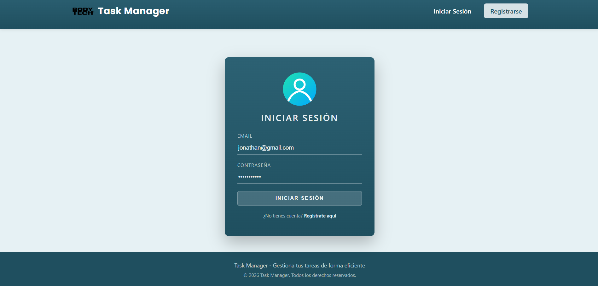
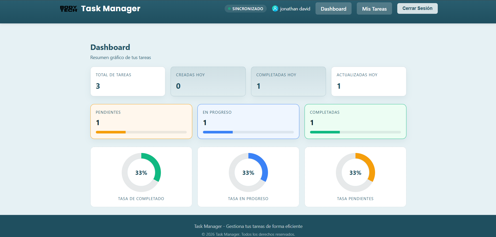

# **📘Aplicación Gestor de Tareas FullStack - Guía de la Solución y Manual de Usuario**

---

## 🛠️ Stack tecnologico y Arquitectura


## 👤 Autor

| 👨‍💻 Nombre | 📧 Correo | 🏫 Link directo al repositorio | 🐙 Usuario GitHub |
|---|---|---|---|
| **Jonathan David Fernandez Vargas** | jonathanfdez62@gmail.com | [Link](https://github.com/Jonathand77/task-manager) | [jonathand77](https://github.com/jonathand77) |

**Desarrollo completo de la prueba técnica para el cargo de Desarrollador Full Stack - Gestor de tareas.**

---

## 1. 🔍 Introducción
Esta guía documenta el desarrollo completo de la prueba técnica para el cargo de Desarrollador Full Stack, incluyendo la solución implementada (backend en PHP (Phalcon PHP) y frontend en React + Vite), los pasos de implementación, arquitectura, y el manual de usuario para el funcionamiento de la aplicación.
El Gestor de Tareas Fullstack es una aplicación web diseñada para permitir a los usuarios registrarse, autenticarse y gestionar sus tareas personales de forma segura y eficiente. El proyecto implementa una arquitectura fullstack moderna, separando claramente responsabilidades entre backend, frontend y base de datos, e integrando buenas prácticas de seguridad, escalabilidad y mantenibilidad.
La solución fue desarrollada utilizando PHP con Phalcon para el backend, React + Vite + Redux Toolkit para el frontend y PostgreSQL como motor de base de datos, todo orquestado mediante Docker.

## 2. ⚙️ Requisitos Previos
- Antes de comenzar, asegúrate de contar con:
- Docker Desktop (corriendo)
- Docker Compose (incluido en Docker Desktop)
- Node.js 18+ y npm
- Git
- **Nota**: Los archivos más importantes de este repositorio cuentan con sus comentarios para su más fácil interpretación.

## 📦 Estructura del Proyecto

```
task-manager/
├──  RAÍZ
│   ├── .env.example
│   ├── .gitignore
│   ├── .git/
│   ├── .github/
│   ├── docker-compose.yml
│   ├── README.md
│   ├── QUICKSTART_PROYECT.md
│
├── BACKEND/
|   ├── README.md (Dentro del README.md se encuentra la estructura del Backend)
│   ├── app/
│   ├── bin/
│   ├── config/
│   ├── database/
│   ├── public/
│   ├── vendor/
│   ├── .env.example
│   ├── composer.json
│   ├── Dockerfile
│
└── 💻 FRONTEND/
    ├── README.md (Dentro del README.md se encuentra la estructura del Frontend)
    ├── src/
    ├── .env.example
    ├── package.json
    ├── package-lock.json
    ├── Dockerfile
    ├── vite.config.js
    ├── index.html
    └── node_modules/
```

---

## 3. 🖥️ Guía Paso a Paso para Levantar el Proyecto
### 3.1 Preparar Variables de Entorno

En la raíz del repositorio, crea o revisa el archivo `.env.example`

**⚠ ️ Nota:** El proyecto utiliza múltiples archivos .env según la capa.
Para levantar el proyecto con Docker, solo es obligatorio crear el archivo .env en la raíz a partir de .env.example siguiente.
Los .env de backend/ y frontend/ son opcionales y solo se usan en ejecuciones locales sin Docker y que concuerden con cada .env.example.
Puedes ejecutar: 

```bash
cp .env.example .env
```
### 3.2 Levantar Servicios con Docker

Desde la raíz del proyecto, ejecutar:

```bash
docker-compose up -d --build
docker-compose ps
```

**Esto levantará automáticamente:**
- PostgreSQL
- Backend (Phalcon PHP)
- Frontend
- Infraestructura base del proyecto
- Migraciones se ejecutan solas
- WebSockets


### 3.3 Ejecutar el Frontend

Desde el host (no Docker):

```bash
npm --prefix frontend install
npm --prefix frontend run dev -- --port 5174
```

**Ya puedes abrir en el navegador y utilizar la aplicación:**
http://localhost:5174/

---

## 4. 🖥️ Backend – API con Phalcon PHP
### 4.1 Modelos (Domain Layer)
Entidades principales:
- **User**: id, name, email, password_hash, created_at
- **Task**: id, user_id, title, description, status, created_at, updated_at

### 4.2 Autenticación JWT
- Endpoints: `/api/auth/register`, `/api/auth/login`
- El backend emite un JWT al autenticarse
- En el frontend se guarda el token y se envía en `Authorization: Bearer <token>`
- Middleware protege rutas privadas

### 4.3 Endpoints del proyecto
- **Auth**: POST `/api/auth/register`, POST `/api/auth/login`
- **Tasks**: GET `/api/tasks`, POST `/api/tasks`, PUT `/api/tasks/{id}`, DELETE `/api/tasks/{id}`
- **Tasks por estado**: GET `/api/tasks/filter/{status}`

### 4.5 Buenas Prácticas y Arquitectura
- **Arquitectura en capas (Layered/MVC)**: Controllers → Services → Models
- **PSR-4** en autoload y nombres de carpetas
- **JWT Middleware** para rutas privadas
- **Validación** centralizada en servicios
- **Separación REST + WebSocket** para tiempo real

## 5. 🚀 Frontend - React + Vite
### 5.1 Autenticación en frontend
- Login y registro con formulario
- JWT guardado
- Axios agrega `Authorization: Bearer <token>` en cada request
- Manejo global de 401/403: limpia sesión y redirige a `/login`

### 5.2 Componentes clave
- **LoginPage**: autenticación



- **RegisterPage**: Registro


- **DashboardPage**: Gestion de tareas del usuario



- **TaskPage**: listar y gestionar tareas


## 6. Pruebas manuales (En mi caso use Postman)
- **Registrar usuario**: POST `/api/auth/register`
```bash
{ "name": "Pepito123",
  "email": "pepito@gmail.com",
  "password": "P@ssw0rd!" }
```
- **Login**: POST `/api/auth/login`
```bash
{ "email": "pepito@gmail.com",
  "password": "P@ssw0rd!" }
```
- **Crear tarea**: POST `/api/tasks`
```bash
{ "title": "Mi primera tarea",
  "description": "Descripción opcional",
  "status": "pending" }
```
- **Actualizar tarea**: PUT `/api/tasks/{id}`
```bash
{ "title": "Título actualizado",
  "status": "in_progress" }
```
- **Eliminar tarea**: DELETE `/api/tasks/{id}`

## 7. 🌐 Seguridad
- JWT para autenticación y autorización
- Variables sensibles en `.env.example` (no versionadas)
- Middleware protege rutas privadas
- Sanitización y validación en servicios
- WebSocket autenticado con token

---
## **Fin de la guía y manual de usuario.**